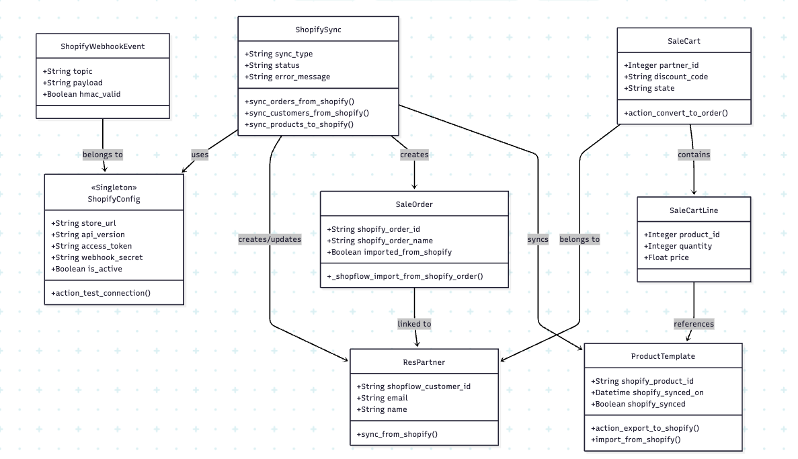
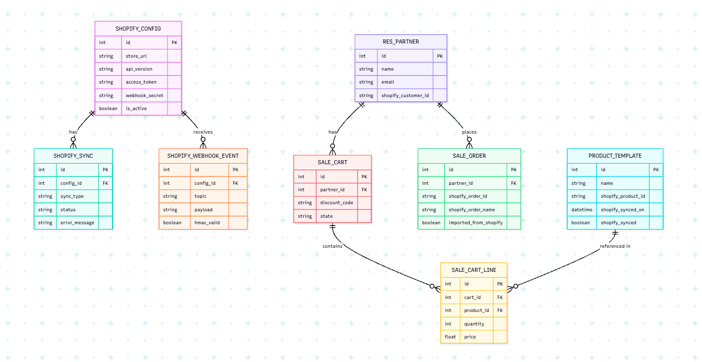

# Shopify E-Commerce Connector for Odoo 17


---

## Problem Statement

Small and medium-sized enterprises (SMEs) that operate Shopify storefronts alongside Odoo ERP systems face a critical operational challenge: data lives in two disconnected places. Store managers are forced to manually re-enter orders, update inventory counts, and reconcile customer records across both platforms — a process that is time-consuming, error-prone, and impossible to scale.

Without a reliable sync layer, inventory mismatches cause overselling, delayed order processing leads to poor customer experiences, and sales teams lack visibility into which customers are most likely to convert. Marketing teams cannot act on abandoned cart data, and customer support has no unified view of a buyer's purchase history.

This project solves that problem by building a **bidirectional synchronization module** that deeply integrates Shopify with Odoo 17. Products flow from Odoo to Shopify automatically. Orders placed on Shopify are imported into Odoo as native sale orders. Inventory levels are kept in sync via scheduled jobs and real-time webhooks. The module also lays the foundation for AI-powered features including product recommendations, lead scoring, and chatbot-assisted support — turning raw store data into actionable business intelligence.

---

## Key Features

- **Customer Sync (Upsert)** — `res.partner.sync_from_shopify(customer_data)` maps Shopify `id`, `email`, `first_name`, and `last_name` into partner fields, then upserts by `shopflow_customer_id` first and `email` second.
- **Order Import Pipeline** — `shopify.sync.sync_orders_from_shopify()` pulls Shopify orders and calls `sale.order._shopflow_import_from_shopify_order()` to create Odoo quotations/orders with mapped partner and line items.
- **Duplicate Protection on Orders** — `sale.order.shopify_order_id` is indexed and unique, so already-imported Shopify orders are skipped safely.
- **Auto Fulfillment for Paid Orders** — Imported orders with `financial_status = paid` are auto-confirmed and run through picking validation logic.
- **Product Export + Import** — `product.template.action_export_to_shopify()` upserts product payloads to Shopify and stores `shopify_product_id`, `shopify_synced`, and `shopify_synced_on`; `import_from_shopify()` paginates products and upserts templates/variants.
- **Sync Logging + Config Health** — `shopify.sync.log` tracks sync status (`pending/success/failed`) and `shopify.config.action_test_connection()` verifies API connectivity with cached token handling.

---

## Use Cases

1. **As an operations user**, I can run customer sync so Shopify customers are created/updated in `res.partner` using `shopflow_customer_id` and email matching.

2. **As a sales user**, I can import Shopify orders into Odoo and keep a stable external mapping via `sale.order.shopify_order_id` to prevent duplicates.

3. **As a fulfillment user**, paid Shopify orders are auto-confirmed and trigger picking validation, reducing manual follow-up after import.

4. **As a catalog manager**, I can export a product from `product.template` to Shopify and retain the returned `shopify_product_id` for future updates.

5. **As a catalog manager**, I can import Shopify products in bulk and upsert templates/variants in Odoo using Shopify product/variant identifiers.

6. **As an admin**, I can test Shopify credentials in `shopify.config` and review per-run outcomes in `shopify.sync.log`.

---

## Architecture Overview

```
┌──────────────────────────────┐
│ Shopify Admin API            │
│ (products, orders, customers)│
└───────────────┬──────────────┘
                │
┌───────────────▼────────────────────────────────────────────────┐
│ Odoo module: shopify_ecommerce                                 │
│                                                                │
│  shopify.config                                                 │
│  - stores credentials/store URL                                │
│  - builds authenticated client                                 │
│  - action_test_connection()                                    │
│                                                                │
│  shopify.sync (service model)                                  │
│  - sync_orders_from_shopify()                                  │
│  - sync_products_to_shopify()                                  │
│  - sync_customers_from_shopify()                               │
│  - writes shopify.sync.log per sync run                        │
│                                                                │
│  Domain model handlers                                          │
│  - res.partner.sync_from_shopify()                             │
│  - sale.order._shopflow_import_from_shopify_order()            │
│  - product.template.action_export_to_shopify()/import_from_... │
└───────────────┬────────────────────────────────────────────────┘
                │
┌───────────────▼──────────────┐
│ PostgreSQL (Odoo ORM models) │
└──────────────────────────────┘
```

**Sync Flows:**

| Direction | Trigger | Mechanism |
|---|---|---|
| Shopify → Odoo (Customers) | Manual/cron customer sync | `shopify.sync.sync_customers_from_shopify()` → `res.partner.sync_from_shopify()` |
| Shopify → Odoo (Orders) | Manual/cron order sync | `shopify.sync.sync_orders_from_shopify()` → `sale.order._shopflow_import_from_shopify_order()` |
| Odoo → Shopify (Products) | Product button / product sync job | `product.template.action_export_to_shopify()` via configured Shopify client |
| Shopify → Odoo (Products) | Product import operation | `product.template.import_from_shopify()` → `_upsert_product_from_shopify()` |

---

## Setup & Run

### Prerequisites

- Docker Desktop installed and running
- Git

### Start the Application

```bash
# Clone the repository
git clone https://github.com/nandar-zaw/shopify_ecommerce.git
cd shopify_ecommerce

# Start Odoo 17 + PostgreSQL 15
docker-compose up -d

# View logs
docker logs -f odoo17
```

### Access the Application

| Service | URL | Credentials |
|---|---|---|
| Odoo Web UI | http://localhost:8069 | admin / admin |
| PostgreSQL | localhost:5433 | odoo / odoo |

### Install the Module

1. Open http://localhost:8069
2. Go to **Apps** → search "Shopify E-Commerce Connector"
3. Click **Install**

### Configure Shopify Connection

1. Go to **Shopify → Configuration → Stores**
2. Create a new `shopify.config` record
3. Enter your store URL, API key, access token, and webhook secret
4. Click **Test Connection**

### Enable Sync Cron Jobs

1. Go to **Settings → Technical → Automation → Scheduled Actions**
2. Enable: `Shopify: Import Orders`, `Shopify: Sync Inventory`

---

## Running Tests

### Unit Tests (no Odoo or DB required)

```bash
python -m unittest discover -s addons/shopify_ecommerce/tests -p "test_dto.py" -v
```

### Integration Tests (requires running Odoo)

```bash
docker exec -it odoo17 odoo shell -d odoo17
# Then from the Odoo shell:
# env['shopify.config'].search([])
```

Or run via Odoo's test runner:

```bash
docker exec -it odoo17 python -m pytest addons/shopify_ecommerce/tests/test_shopify_config_integration.py
```

---

## Security

This module uses **Odoo 17's built-in authentication and role-based access control**:

- All model permissions are defined in `security/ir.model.access.csv`
- Shopify API credentials (access token, webhook secret) are stored as encrypted fields on `shopify.config`
- Webhook payloads are validated using HMAC-SHA256 before processing (`hmac_valid` field)
- Odoo session-based authentication controls access to all views and actions
- Users must have the `Shopify Manager` or `Shopify User` group to access sync features

---

## Tech Stack

| Component | Technology |
|---|---|
| Language | Python 3.10+ |
| ERP Framework | Odoo 17 (Community) |
| Database | PostgreSQL 15 |
| Containerization | Docker Compose |
| External API | Shopify REST API v2024-01 |
| CI/CD | GitHub Actions |
| Testing | Python `unittest`, Odoo `TransactionCase` |

---

## Project Structure

```
addons/shopify_ecommerce/
├── __manifest__.py              # Module metadata + dependencies
├── models/
│   ├── shopify_config.py        # Store connection + API client
│   ├── shopify_sync.py          # Sync engine + webhook handler
│   ├── dto.py                   # Data Transfer Objects (DTOs)
│   ├── ai_models.py             # Recommendations, lead scoring, chatbot
│   ├── product_template.py      # Product sync extensions
│   ├── sale_order.py            # Order import extensions
│   ├── sale_cart.py             # Abandoned cart model
│   └── stock_quant.py           # Inventory sync + low-stock alerts
├── views/
│   ├── shopify_config_views.xml
│   └── sale_cart_views.xml
├── data/
│   └── cron_jobs.xml            # Scheduled jobs (disabled by default)
├── security/
│   └── ir.model.access.csv      # Access control rules
├── tests/
│   ├── test_dto.py              # Unit tests (no DB required)
│   └── test_shopify_config_integration.py  # Integration tests
└── controllers/                 # Future webhook HTTP endpoints
docs/
├── class_diagram.md             # Mermaid domain model class diagram
└── er_diagram.md                # Mermaid ER diagram
.github/
└── workflows/
    └── ci.yml                   # GitHub Actions CI pipeline
```

---

## CI/CD

This project uses **GitHub Actions** for continuous integration. On every push or pull request to `main`:

1. Checks out the code
2. Sets up Python 3.10
3. Runs all unit tests in `tests/test_dto.py` (no DB or Odoo needed)
4. Reports pass/fail

See `.github/workflows/ci.yml` for the full pipeline definition.

---

## Diagrams

- **Domain Model Class Diagram**  
  
- **Database ER Diagram**
  

Both diagrams use [Mermaid](https://mermaid.live) syntax and render natively in GitHub.

---

## License

MIT License — see [LICENSE](LICENSE) for details.
